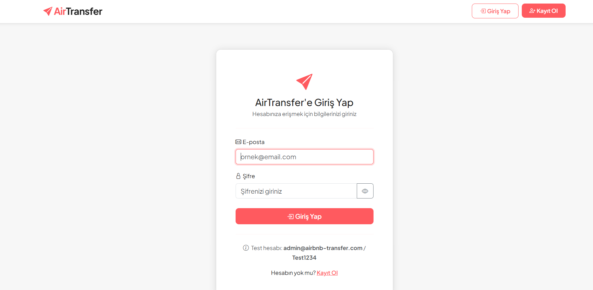
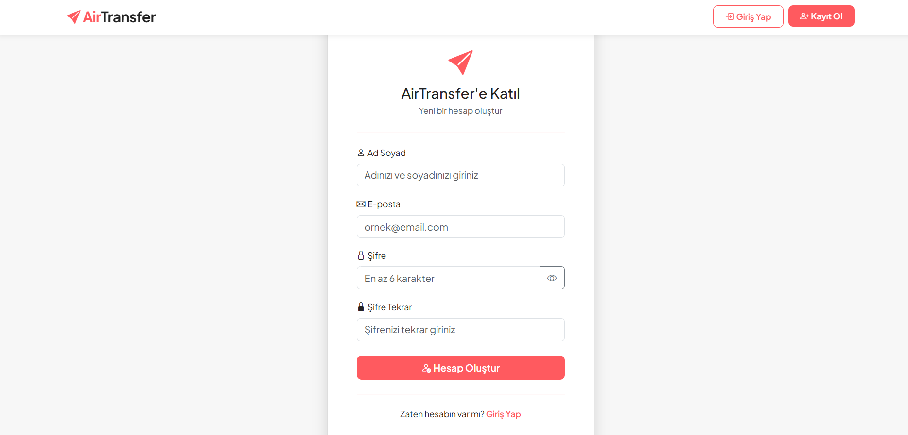
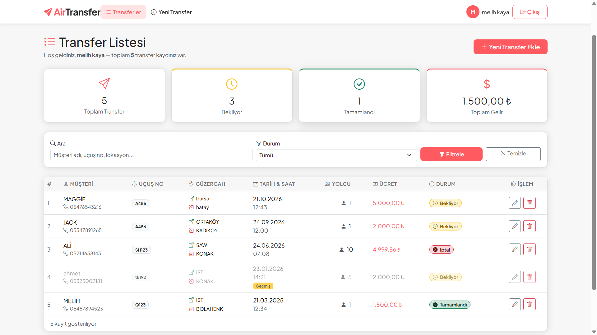
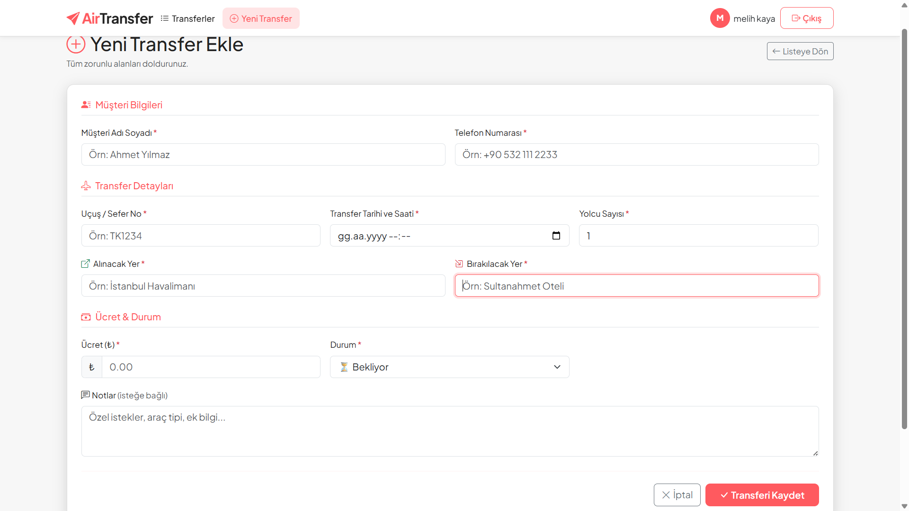
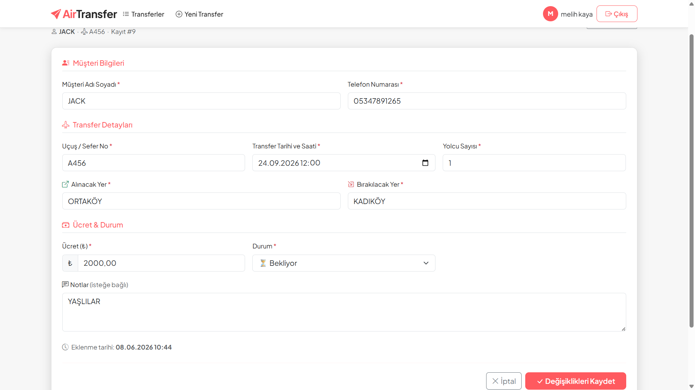

# ✈️ AirTransfer — Airbnb Müşteri Transfer Takip Sistemi
 
> PHP & MySQL · Bootstrap 5 · Yalın (Core) PHP · PDO · OOP-Free Prosedürel Mimari

---

## 📌 Proje Hakkında

**AirTransfer**, Airbnb ev sahiplerinin ve transfer koordinatörlerinin müşteri transfer süreçlerini kolayca yönetebileceği, web tabanlı bir takip uygulamasıdır.

Sistem; kullanıcı kaydı ve güvenli girişten başlayarak transfer ekleme, listeleme, düzenleme ve silme işlemlerine kadar tam bir **CRUD + Auth** döngüsü sunar.

---

## 🎬 Uygulama Videosu

> 📹 **Demo Videosu (1–3 dk):**  
> [(https://1drv.ms/v/c/2cec5184885fe4d0/IQDIKnkrd7fpS5nfE-Ina_p3AcgBcz59PuAUnemdj1Y3DHA?e=KaPu8y)]

---

## 🖼️ Ekran Görüntüleri

### Giriş Sayfası


### Kayıt Sayfası


### Transfer Listesi (Ana Sayfa)


### Yeni Transfer Ekle


### Transfer Düzenle


---

## ⚙️ Kullanılan Teknolojiler

| Katman     | Teknoloji                              |
|------------|----------------------------------------|
| Arka Uç    | PHP 8+ (Yalın / Core PHP, sıfır framework) |
| Veritabanı | MySQL 8 / MariaDB — PDO ile erişim     |
| Ön Uç      | HTML5, Bootstrap 5.3, Bootstrap Icons  |
| Yazı Tipi  | Google Fonts — Plus Jakarta Sans       |
| Oturum     | PHP `$_SESSION` (çerez tabanlı DEĞİL)  |
| Şifreleme  | `password_hash()` / `password_verify()`|

---

## 🗂️ Dosya Yapısı

```
airbnb_transfer/
│
├── airbnb_transfer.sql   # Veritabanı şeması ve örnek veriler
├── config.php            # PDO bağlantısı, session başlatma, yardımcı fonksiyonlar
│
├── index.php             # Transfer listesi — Read (istatistik + filtre + renklendirme)
├── add_transfer.php      # Yeni transfer ekleme — Create
├── edit_transfer.php     # Transfer düzenleme — Update
├── delete_transfer.php   # Transfer silme — Delete
│
├── register.php          # Kullanıcı kaydı
├── login.php             # Kullanıcı girişi
├── logout.php            # Oturum sonlandırma
│
└── includes/
    ├── header.php        # Bootstrap navbar, CSS değişkenleri, flash mesajları
    └── footer.php        # Footer, Bootstrap JS bundle
```

---

## 🗄️ Veritabanı Tasarımı

### `users` Tablosu

| Sütun        | Tür            | Açıklama                        |
|--------------|----------------|---------------------------------|
| `id`         | INT UNSIGNED   | Birincil anahtar, auto increment|
| `name`       | VARCHAR(100)   | Kullanıcı adı soyadı            |
| `email`      | VARCHAR(150)   | Benzersiz e-posta               |
| `password`   | VARCHAR(255)   | `password_hash()` ile hash'li   |
| `created_at` | DATETIME       | Kayıt tarihi                    |

### `transfers` Tablosu

| Sütun                | Tür              | Açıklama                             |
|----------------------|------------------|--------------------------------------|
| `id`                 | INT UNSIGNED     | Birincil anahtar                     |
| `user_id`            | INT UNSIGNED     | `users.id` yabancı anahtarı          |
| `customer_name`      | VARCHAR(150)     | Müşteri adı soyadı                   |
| `customer_phone`     | VARCHAR(20)      | Telefon numarası                     |
| `flight_no`          | VARCHAR(20)      | Uçuş / sefer numarası                |
| `pickup_location`    | VARCHAR(255)     | Alınacak lokasyon                    |
| `dropoff_location`   | VARCHAR(255)     | Bırakılacak lokasyon                 |
| `passenger_count`    | TINYINT UNSIGNED | Yolcu sayısı                         |
| `transfer_datetime`  | DATETIME         | Transfer tarih ve saati              |
| `price`              | DECIMAL(10,2)    | Transfer ücreti (₺)                  |
| `notes`              | TEXT             | Ek notlar (isteğe bağlı)             |
| `status`             | ENUM             | `bekliyor` / `tamamlandı` / `iptal`  |
| `created_at`         | DATETIME         | Kayıt oluşturma tarihi               |

---

## ✅ Özellikler

### 🔐 Kimlik Doğrulama (Auth)
- Kullanıcı kaydı — şifre `password_hash(PASSWORD_DEFAULT)` ile hash'lenerek saklanır
- Güvenli giriş — `password_verify()` ile doğrulama
- Oturum yönetimi — `$_SESSION` (düz çerez kullanılmaz)
- Session fixation koruması — girişte `session_regenerate_id(true)`
- Güvenli çıkış — `session_destroy()` + cookie temizleme
- Yönlendirme koruması — giriş yapılmamışsa tüm sayfalar `login.php`'ye yönlendirir

### 📋 Transfer Yönetimi (CRUD)
- **Create** — 3 bölümlü form ile yeni transfer ekleme
- **Read** — istatistik kartları, arama + durum filtresi, renk kodlamalı tablo
- **Update** — mevcut verilerle dolu form, sahiplik kontrolü
- **Delete** — Bootstrap modal onayı, POST-only silme, sahiplik kontrolü

### 🎨 Arayüz
- Airbnb tarzı renk paleti (`#FF5A5F` coral + beyaz + açık gri)
- Tam Bootstrap 5.3 ile stillendirilmiş — ham hiçbir HTML elemanı yok
- Responsive tasarım — mobil uyumlu navbar ve tablo
- Durum rozetleri: 🟡 Bekliyor · 🟢 Tamamlandı · 🔴 İptal
- Tarihi geçmiş & hâlâ "bekliyor" transferler soluk/gri gösterilir + "Geçmiş" etiketi
- Flash mesaj sistemi — her işlem sonrası bildirim

---

## 🔒 Güvenlik Özeti

| Risk                    | Önlem                                              |
|-------------------------|----------------------------------------------------|
| SQL Injection           | PDO Prepared Statements — tüm sorgularda           |
| XSS                     | `htmlspecialchars()` tabanlı `e()` fonksiyonu      |
| Şifre açık metin        | `password_hash()` / `password_verify()`            |
| Session Fixation        | `session_regenerate_id(true)` — girişte            |
| Yetkisiz kayıt erişimi  | `WHERE id = ? AND user_id = ?` sahiplik kontrolü   |
| CSRF (silme)            | Silme yalnızca POST ile; modal onayı gerektirir    |
| Kullanıcı numaralandırma| Giriş hatası her zaman aynı mesajı gösterir        |

---

## 🚀 Kurulum

### Gereksinimler
- PHP 8.0+
- MySQL 8.0+ veya MariaDB 10.4+
- Apache / Nginx (XAMPP, WAMP, Laragon vb.)

### Adımlar

**1. Depoyu klonla veya indir:**
```bash
git clone https://github.com/kullanici-adi/airbnb_transfer.git
```

**2. Klasörü sunucuya taşı:**
```
XAMPP → htdocs/airbnb_transfer/
WAMP  → www/airbnb_transfer/
```

**3. Veritabanını oluştur:**
- phpMyAdmin'i aç
- `airbnb_transfer.sql` dosyasını içe aktar (Import)

**4. Bağlantı ayarlarını güncelle:**

`config.php` dosyasını aç ve kendi bilgilerinle düzenle:
```php
define('DB_HOST', 'localhost');
define('DB_NAME', 'airbnb_transfer');
define('DB_USER', 'root');       // ← kendi kullanıcı adın
define('DB_PASS', '');           // ← kendi şifren
```

**5. Uygulamayı aç:**
```
http://localhost/airbnb_transfer/
```


---


## 📌 Kurallara Uyum

| Kural                                        | Durum |
|----------------------------------------------|-------|
| Arka uçta PHP framework kullanılmadı         | ✅ Sıfır framework, yalın PHP + PDO |
| Şifreler hash'li saklanıyor                  | ✅ `password_hash(PASSWORD_DEFAULT)` |
| Oturum `$_SESSION` ile yönetiliyor           | ✅ Düz çerez kullanılmadı |
| Bootstrap ile tam stillendirme               | ✅ Ham HTML elemanı yok |
| `.htaccess` dosyası yok                      | ✅ Projede `.htaccess` bulunmuyor |
| En az 2 tablo (`users` + `transfers`)        | ✅ Foreign key ile ilişkili |

---

## 👤 Geliştirici

| | |
|---|---|
| **Ad Soyad** | Ahmet Melih Kaya |
| **Ders** | Web Tabanlı Programlama |


---

> *Bu proje, Web Tabanlı Programlama dersi final projesi kapsamında geliştirilmiştir.*
